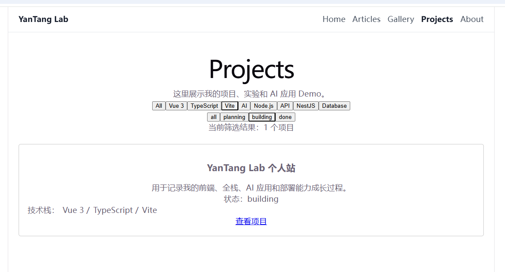

# Week 01 基础补强测评卷｜答题模板

保存路径：docs/exams/week-01-foundation-exam-answer.md

## 0. 基本信息

- 日期：
- 是否独立完成：
- 是否查资料：
- npm run build 是否通过：
- Git commit 信息：

## 一、JavaScript 基础

### 1. map 和 filter 区别

```txt
map遍历一个数组，filter是根据特定条件筛选数组中的元素。他们都是返回一个新得数组，不会改变原本得数组
```

### 2. includes

```txt
includes是用于字符串是否包含另一个字符串，或是数组是否包含另一个元素的函数，返回值是boolean类型得。 比如一个数组[vue,js].includes('vue')返回true。
```

### 3. new Set

```txt
new set 是一个构造函数，他是生成一个新的set对象， 他返回的不是数组。
```

### 4. flatMap

```txt
flatMap() 等价于 一个数组.map().flat()
```

### 5. 响应式更新

```txt
响应式更新，就是vue项目的数据变化之后 自动更新到渲染层面， 不需要手动触发更新。
```

### 代码题

```ts
// 1. title 数组
const title是= projects.map(item => item.title)
// 2. 筛选 Vue 3 项目
const vue3Pro = projects.filter( item => item.techStack.includes('Vue 3'))
// 3. flatMap 技术栈
const techList = projects.flatMap(item => item.techStack)
// 4. new Set 去重
const newList = [...new Set(techList)]
// 5. getProjectsByTech
const getProjectsByTech = (tech:string) => {
    const pro = projects.filter( item => item.techStack.includes(tech))
    return pro
}
```

## 二、CSS 基础

```txt
1. 盒模型：
content,padding,border,margin
2. flex：
弹性布局， 可以实现水平和垂直方向的布局。
3. justify-content / align-items：
justify-content 用于设置flex-direction 的主轴方向的布局。
align-items 用于设置flex-direction 的侧轴对齐方向的布局。
4. sticky / fixed：
sticky和fixed的区别是，stickys是粘性的，fixed是固定位置的。
5. 响应式布局：
flex-wrap 是换行，grid-template-columns是列数，max-width 是最大宽度。 常用来设置一个盒子的最大宽度。
```

```css
/* 1. page-shell */
.page-shell{
    max-width:1080px;
    margin:0 auto;
    padding:0 24px;
}
/* 2. nav-list */
.nav-list{
    display:flex;
    gap:16px;
    flex-wrap:wrap;
}
/* 3. project-list */
.project-list{
    display:grid;
    gap:16px;
}
/* 4. card hover */
.card{
    border-radius:10px;
    border:1px solid #e5e5e5;
    padding:16px;
}
.card:hover{
    transform:translateY(-4px);
}
/* 5. media query */
@media screen and (max-width:640px) {
    h1{
        font-size:36px;
    }
}
```

## 三、TypeScript 基础

```txt
1. Project 类型：
在ts中先申明参数的类型，再去定义参数。更加安全。
2. link?: string：
问号表示不一定有这个参数，可选参数。
3. 联合类型：
这样子可以限制参数的值，必定出于这几个中。
4. 'All' | string：
因为string类型包含了所有的字符串，他的限制能力不够强。然后前面的All 就显得有点多余了。
```

```ts
// ProjectStatus / Project
export type ProjectStatus = 'planning' | 'building' | 'done'
export type Project = {
    id: number
    title: string
    techStack: string[]
    link?: string
    status: ProjectStatus
}
// GalleryType / GalleryItem
export type GalleryType = 'xiaohongshu' | 'poster' | 'download'
export type GalleryItem = {
    id: number
    type: GalleryType
    link: string
}
```

## 四、Vue3 基础

```txt
1. SFC 三部分：
template负责的是html内容的编写，script setup负责的是js逻辑内容的编写，包括一些方法的定义和参数的定义。style scoped 是用来写css样式的， 并且scoped是限制了css只在这个vue下面生效。
2. props：
组件之间传参的方法，子组件可以接收父组件传递过来的参数。 ProjectCard是封装好的组件， 内部也都是定义的形参，需要父组件调用的时候传入实参。
3. v-for key：
：key 是用来作为唯一标识的。用来渲染。
4. 数据流：
单向数据流，从ProjectsView.vue 传递到 ProjectCard.vue。
5. App.vue：
App可以作为一个入口文件，用来引入所有的组件。  如果所有页面都直接写在这个app.vue上面，首先会非常冗余，后期维护起来也是特别麻烦。然后项目成了个单页面。每次渲染可能都要渲染所有内容，在使用性能方面也比较差。
```

```vue
<!-- ProjectCard props -->
defineProps({
    project: {
        type: Object,
        default: () => ({})
    }
})
```

```vue
<!-- 父组件 v-for -->
<ProjectCard v-for="project in projects" :key="project.id" :project="project" />

```

## 五、Vue Router

```txt
1. 解决什么问题：
Vue Router是vue里面用来处理路由的。 配置了前端页面路由和组件的对应关系，用户点击路由链接，会跳转到对应的组件。
2. RouterLink：
RouterLink 是用来创建路由链接的组件。 点击路由链接，会跳转到对应的路由。
RouterLink 组件的属性：
to：路由路径。
exact：是否精确匹配。
replace：是否替换当前路由。
3. RouterView：
RouterView是用来渲染组件的，根据当前路由，会渲染对应的组件。
4. 404 路由：
404放最后，是因为当其他所有路由失效 不匹配之后 才跳转到404页面。
```

```ts
// 最小路由配置
const router = createRouter({
    history: createWebHashHistory(),
    routes: [
        {
            path: '/',
            component: () => import('@/views/ProjectsView.vue')
        },
        {
            path: '/projects',
            component: () => import('@/views/ProjectView.vue')
        }
        {
            path: '/404',
            component: () => import('@/views/NotFound.vue')
        }
    ]
})
```

## 六、Pinia

```txt
1. Pinia 解决什么问题：
Pinia 是vue用来做状态管理的库，可以存放一些全局状态，存放一些全局计算值，以及一些公共方法。
2. state/getters/actions：
state：用来存放全局状态的。
getters：用来存放全局计算值的。
actions：用来存放全局方法的。
3. Pinia 和 props：
props：用来接收父组件传递过来的参数的。
Pinia是用来存放全局的状态的。
4. 适合/不适合放 Pinia 的数据：
适合放：
- 全局状态
- 全局计算值
- 全局方法
不适合放：
- 组件状态
- 组件计算值
- 组件方法
5. featuredProjects：
他是由状态值计算出来的值，所以是getter。
getters：用来存放全局计算值的。
```

```ts
// 最小 Pinia store
import { defineStore } from 'pinia'
const usePortfolioStore = defineStore('portfolio', {
    const activeProjectStatus = ref('all')
    const projects = ref<Project[]>([])
    const filteredProjects = computed(() => {
        if (activeProjectStatus.value === 'all') {
            return projects.value
        }
        return projects.value.filter(project => project.status === activeProjectStatus.value)
    })
    function setActiveProjectStatus(status: ProjectStatus) {
        activeProjectStatus.value = status
    }
})
```

## 七、Git / Markdown

```txt
1. git status：
用来查看当前代码有没有改动。
2. git add .：
把所有的内容提交到贮存区。
3. git commit：
提交改动到本地仓库。
4. git push：
把本地仓库内容推送到远端仓库。
5. 敏感文件：
这些东西提交到公共库不好，会导致隐私泄露。
6. TS 代码块：
ts
7. Vue 代码块：
vue
8. Vue 代码不能普通文本：
代码要写在代码块里 不能写在文本里。
9. [!WARNING]：
警告：
提交到公共库不好，会导致隐私泄露。
10. 复盘：
用来复查每天的内容，以便后续可以先看到今日的问题。
```

## 八、技术英语

```txt
1.

2.

3.
```

英文项目介绍：

```txt
英语不分暂时先不做
```

## 九、实战任务

### 修改说明

```txt

```

### usePortfolioStore.ts

```ts
import { defineStore } from 'pinia'
import type { GalleryType, GalleryItem } from '../types/gallery'
import type { Project } from '../types/project'

export type ProjectFilter = 'All' | string
export type GalleryFilter = 'all' | GalleryType
export type ProjectStatusFilter = 'all' | string

export const usePortfolioStore = defineStore('portfolio', {
    state: () => ({
        activeProjectTag : 'All' as ProjectFilter,
        activeGalleryType : 'all' as GalleryFilter,
        activeProjectStatus: 'all' as ProjectStatusFilter,
        projectStatusTags: ['all', 'planning', 'building', 'done'],
        projects: [
            {
              id: 1,
              title: 'YanTang Lab 个人站',
              description: '用于记录我的前端、全栈、AI 应用和部署能力成长过程。',
              techStack: ['Vue 3', 'TypeScript', 'Vite'],
              link: 'https://github.com/Biscuit733/yantang-lab',
              status: 'building',
            },
            {
              id: 2,
              title: 'AI Content Hub',
              description: '后续用于沉淀 AI 文案、图片资源和内容管理能力。',
              techStack: ['AI', 'Node.js', 'API'],
              status: 'planning',
            },
            {
              id: 3,
              title: 'MES Lite',
              description: '面向制造业业务场景的轻量级管理系统练习项目。',
              techStack: ['Vue 3', 'NestJS', 'Database'],
              status: 'planning',
            },
          ] as Project[],

        gallery: [
            {
              id: 1,
              title: '小红书封面模板',
              type: 'xiaohongshu',
              description: '后续用于沉淀可复用封面资源。',
            },
            {
              id: 2,
              title: 'AI 海报资源',
              type: 'poster',
              description: '用于展示视觉资源和下载入口。',
            },
            {
              id: 3,
              title: '学习资料下载',
              type: 'download',
              description: '后续放 PDF、Markdown、图片素材。',
            },
          ] as GalleryItem[]
    }),

    getters: {
        projectTags(state) {
          const tags = state.projects.flatMap((project) => project.techStack)
          return ['All', ...new Set(tags)]
        },
        filteredProjects(state) {
          if (state.activeProjectTag === 'All') {
            if (state.activeProjectStatus === 'all') {
              return state.projects
            }
            return state.projects.filter((project) => project.status.includes(state.activeProjectStatus))
          }
          if (state.activeProjectStatus === 'all') {
            return state.projects.filter((project) => project.techStack.includes(state.activeProjectTag))
          }
          return state.projects.filter((project) =>
            project.techStack.includes(state.activeProjectTag) && project.status.includes(state.activeProjectStatus),
          )
        },
    
        galleryTypes(state): GalleryFilter[] {
          const types = state.gallery.map((item) => item.type)
          return ['all', ...new Set(types)]
        },
    
        filteredGallery(state) {
          if (state.activeGalleryType === 'all') {
            return state.gallery
          }
    
          return state.gallery.filter((item) => item.type === state.activeGalleryType)
        },
    
        featuredProjects(state) {
          return state.projects.slice(0, 2)
        },
    },

    actions: {
      setActiveProjectTag(tag: ProjectFilter) {
        this.activeProjectTag = tag
      },
  
      resetProjectFilter() {
        this.activeProjectTag = 'All'
      },
  
      setActiveGalleryType(type: GalleryFilter) {
        this.activeGalleryType = type
      },
  
      resetGalleryFilter() {
        this.activeGalleryType = 'all'
      },

      setActiveProjectStatus(status: ProjectStatusFilter) {
        this.activeProjectStatus = status
      },
      resetProjectStatusFilter() {
        this.activeProjectStatus = 'all'
      },
    }
})

```

### ProjectsView.vue

```vue
<template>
  <section class="page">
    <h1>Projects</h1>
    <p>这里展示我的项目、实验和 AI 应用 Demo。</p>

    <div class="filter-list">
      <button
        v-for="tag in store.projectTags"
        :key="tag"
        type="button"
        :class="{ active: store.activeProjectTag === tag }"
        @click="store.setActiveProjectTag(tag)"
      >
        {{ tag }}
      </button>
    </div>

    <div class="filter-list">
      <button
        v-for="status in store.projectStatusTags"
        :key="status"
        type="button"
        :class="{ active: store.activeProjectStatus === status }"
        @click="store.setActiveProjectStatus(status)"
      >
        {{ status }}
      </button>
    </div>

    <p>当前筛选结果：{{ store.filteredProjects.length }} 个项目</p>

    <div class="project-list">
      <ProjectCard
        v-for="project in store.filteredProjects"
        :key="project.id"
        :project="project"
      />
    </div>
  </section>
</template>

<script setup lang="ts">
import ProjectCard from '../components/ProjectCard.vue'
import { usePortfolioStore } from '../stores/usePortfolioStore'

const store = usePortfolioStore()
</script>

<style scoped>
.project-list {
  display: grid;
  gap: 16px;
  margin-top: 24px;
}
.page button.active{
  background-color: #f0f0f0;
}
</style>

```

### 截图说明

```txt

```

### build 结果

```txt
PS D:\tjy\myPro\learnPro\yantang-lab> yarn build
yarn run v1.22.22
$ vue-tsc -b && vite build
vite v8.1.3 building client environment for production...
✓ 58 modules transformed.
computing gzip size...
dist/index.html                  0.46 kB │ gzip:  0.29 kB
dist/assets/index-CWC8Iz7Z.css   5.15 kB │ gzip:  1.78 kB
dist/assets/index-DyIOUZxj.js   99.68 kB │ gzip: 38.48 kB

✓ built in 645ms
Done in 3.06s.
PS D:\tjy\myPro\learnPro\yantang-lab> 
```

## 十、复盘

### 我最确定的 3 个点

```txt
1.
2.
3.
```

### 我最不确定的 3 个点

```txt
1.
2.
3.
```

### 我希望 ChatGPT 接下来重点补的内容

```txt

```
